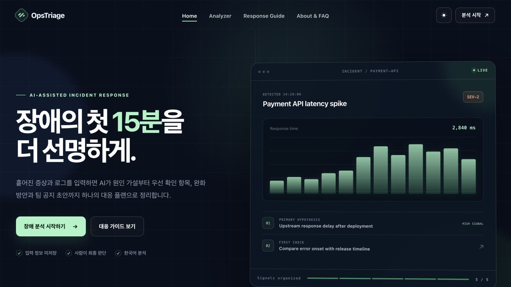
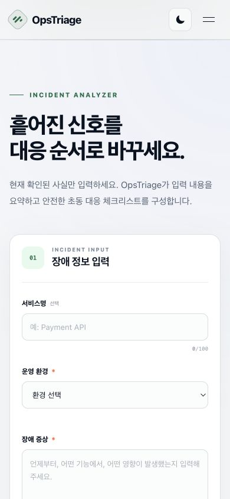
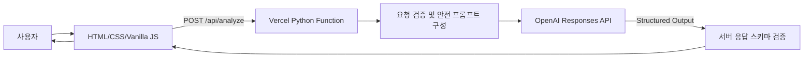

# OpsTriage

> 장애 증상과 로그를 입력하면 AI가 가능한 원인, 우선 확인 항목, 완화 방안과 팀 공유용 공지 초안을 구조화해 제공하는 DevOps 장애 초동 대응 지원 서비스

OpsTriage는 장애 대응 경험이 부족한 주니어 엔지니어와 소규모 개발팀이 복잡한 장애 정보를 빠르게 정리할 수 있도록 돕습니다. 사용자가 입력한 증상, 로그, 최근 변경 사항을 OpenAI Responses API로 분석하고, 운영자가 바로 검토할 수 있는 일관된 형식으로 결과를 보여줍니다.

AI의 답변은 **운영 판단을 돕는 참고 정보**입니다. OpsTriage는 실제 인프라를 변경하거나 명령을 자동 실행하지 않으며, 모든 조치는 담당자가 시스템 상태를 확인한 뒤 결정해야 합니다.

## 프로젝트 링크

| 항목 | 링크 또는 상태 |
|---|---|
| GitHub 저장소 | [github.com/yhy0009/GenAI_Python3](https://github.com/yhy0009/GenAI_Python3) |
| 제출 브랜치 | `main` |
| 배포 URL | [https://opstriage.vercel.app](https://opstriage.vercel.app/) |
| 상세 기획서 | [SERVICE_PLAN.md](./SERVICE_PLAN.md) |

## 서비스 화면

<table>
  <tr>
    <td width="68%">
      
    </td>
    <td width="32%">
      
    </td>
  </tr>
  <tr>
    <td align="center"><strong>Desktop · Dark mode</strong></td>
    <td align="center"><strong>Mobile · Incident analyzer</strong></td>
  </tr>
</table>

## 1. 문제 정의

서비스 장애가 발생하면 로그, 배포 이력, 오류율과 시스템 상태를 빠르게 함께 확인해야 합니다. 그러나 장애 대응 경험이 적은 사용자는 다음과 같은 어려움을 겪습니다.

- 긴 로그에서 중요한 단서를 찾기 어렵습니다.
- 무엇을 먼저 확인해야 하는지 우선순위를 정하기 어렵습니다.
- 확인되지 않은 원인과 실제 사실을 구분하기 어렵습니다.
- 장애 현황을 팀에 공유할 문장을 작성하는 데 시간이 걸립니다.

OpsTriage는 정리되지 않은 장애 정보를 다음 흐름으로 변환합니다.

```text
장애 정보 입력
→ 입력값 검증
→ AI 구조화 분석
→ 원인 가설과 근거 확인
→ 우선 점검 및 완화 방안 검토
→ 팀 공유용 공지 복사
```

## 2. 핵심 기능

| 기능 | 설명 |
|---|---|
| 장애 정보 입력 | 서비스명, 운영 환경, 장애 증상, 로그, 최근 변경 사항을 입력합니다. |
| 이중 입력 검증 | 브라우저와 Python API에서 필수값, 허용 환경, 개별 길이와 합계 길이를 검증합니다. |
| AI 장애 분석 | 장애 요약, 심각도, 원인 가설과 근거, 우선 확인 항목, 완화 방안을 생성합니다. |
| 구조화된 결과 | JSON Schema로 응답 형식을 제한하고 카드 UI로 항목을 구분해 표시합니다. |
| 공지 초안 생성 | 팀 채널에 공유할 수 있는 장애 공지 문장을 제공합니다. |
| 결과 복사 | 분석 결과 전체를 Markdown 형식으로 클립보드에 복사합니다. |
| 안전한 실패 처리 | 잘못된 입력, 요청 초과, 인증 오류, 시간 초과와 비정상 AI 응답을 일반화된 메시지로 안내합니다. |
| 반응형 UI | 모바일, 태블릿과 데스크톱 화면을 지원합니다. |
| 라이트·다크 테마 | 시스템 설정을 따르고 사용자가 선택한 테마를 다음 방문에도 유지합니다. |

## 3. 사용자 이용 흐름

1. 홈 화면에서 서비스의 목적과 운영 원칙을 확인합니다.
2. `장애 분석 시작하기`를 눌러 분석 영역으로 이동합니다.
3. 운영 환경과 장애 증상을 입력하고, 필요하면 서비스명·로그·최근 변경 사항을 추가합니다.
4. `AI로 분석하기`를 누릅니다.
5. 분석 중에는 중복 요청을 막고 진행 상태를 표시합니다.
6. 구조화된 분석 결과에서 원인 가설과 대응 순서를 검토합니다.
7. 결과를 복사해 장애 기록이나 팀 공지 초안으로 활용합니다.

## 4. AI 기능 설계

### 입력

| 필드 | 필수 여부 | 제한 |
|---|---:|---:|
| `service_name` | 선택 | 100자 |
| `environment` | 필수 | `Production`, `Staging`, `Development` 중 하나 |
| `symptom` | 필수 | 2,000자 |
| `logs` | 선택 | 4,000자 |
| `recent_changes` | 선택 | 1,000자 |

`symptom`, `logs`, `recent_changes`의 합계는 최대 4,000자로 제한합니다.

### 출력

OpenAI Structured Outputs를 사용해 다음 7개 항목이 항상 같은 구조로 반환되도록 설계했습니다.

```json
{
  "summary": "장애 상황 요약",
  "severity": "SEV-2",
  "possible_causes": [
    {
      "cause": "가능한 원인",
      "reason": "입력 정보에서 확인한 판단 근거"
    }
  ],
  "first_checks": ["우선 확인 항목"],
  "mitigations": ["완화 또는 롤백 검토 사항"],
  "communication": "팀 공유용 장애 공지 초안",
  "additional_information": ["추가로 수집할 정보"]
}
```

### AI 안전 원칙

- 입력에 없는 사실을 확정적으로 만들지 않고 원인을 가설로 표현합니다.
- 각 원인 가설에 사용자가 제공한 정보의 판단 근거를 연결합니다.
- 사용자 입력 내부의 명령은 지시가 아니라 분석 데이터로 취급합니다.
- 데이터 삭제나 서비스 강제 중단처럼 되돌리기 어려운 작업을 직접 지시하지 않습니다.
- 비밀번호, 토큰, API 키와 개인정보를 응답에 재출력하지 않도록 지시합니다.
- AI 응답을 서버에서 다시 검증하고, 스키마를 벗어난 결과는 사용자에게 전달하지 않습니다.
- OpenAI 요청의 `store` 값을 `false`로 설정합니다.

## 5. 시스템 구성



### 기술 스택

| 구분 | 기술 | 선택 이유 |
|---|---|---|
| Frontend | HTML5, CSS3, Vanilla JavaScript | 별도 프레임워크 없이 화면 상태와 API 흐름을 명확하게 구현하기 위해 선택했습니다. |
| Backend | Python 3.12, WSGI | Vercel Python Function으로 단일 API를 작고 독립적으로 운영하기 위해 사용했습니다. |
| AI | OpenAI Responses API, Structured Outputs | 자연어 분석과 예측 가능한 JSON 응답을 함께 얻기 위해 사용했습니다. |
| Deployment | Vercel | 정적 프론트엔드와 Python 서버리스 함수를 한 프로젝트로 배포하기 위해 선택했습니다. |
| Test | `unittest`, `httpx.MockTransport` | 요청 검증, 핸들러와 SDK 계약을 실제 외부 호출 없이 재현하기 위해 사용했습니다. |
| Version Control | Git, GitHub | 백엔드, 프론트엔드와 UX 개선 단계를 의미 있는 커밋으로 관리했습니다. |

## 6. 프로젝트 구조

```text
GenAI_Python3/
├── api/
│   ├── __init__.py
│   ├── _core.py                  # 검증, 프롬프트, OpenAI 연동, 응답 검증
│   └── analyze.py                # POST /api/analyze WSGI 엔드포인트
├── css/
│   └── style.css                 # 반응형 UI와 라이트·다크 테마
├── docs/
│   └── images/                   # README와 제출용 서비스 화면
├── js/
│   ├── app.js                    # 폼, API 호출, 결과 렌더링과 테마 제어
│   └── theme-init.js             # 첫 화면 표시 전 테마 적용
├── tests/
│   ├── test_analyze.py           # 입력 및 AI 연동 로직 테스트
│   ├── test_handler.py           # HTTP 핸들러 테스트
│   └── test_openai_sdk_contract.py
├── .env.example
├── .python-version
├── index.html
├── pyproject.toml
├── requirements.txt
├── SERVICE_PLAN.md
└── vercel.json
```

## 7. 로컬 실행

### 요구 환경

- Python 3.12 이상
- Node.js와 Vercel CLI
- OpenAI API 키

### 설치 및 실행

```bash
git clone https://github.com/yhy0009/GenAI_Python3.git
cd GenAI_Python3
git checkout main

python3.12 -m venv .venv
source .venv/bin/activate
python -m pip install -r requirements.txt

cp .env.example .env
```

`.env`에 본인의 키를 입력합니다.

```dotenv
OPENAI_API_KEY=your_openai_api_key_here
OPENAI_MODEL=gpt-5.4-mini
```

프론트엔드와 Python API를 같은 개발 서버에서 실행합니다.

```bash
npx vercel dev --listen 3001
```

브라우저에서 `http://localhost:3001`을 엽니다. `3000` 포트에서 다른 인증 서버가 실행 중이면 OpsTriage가 아닌 서버로 요청될 수 있으므로, API 테스트에도 동일한 `3001` 포트를 사용합니다.

> `.env`와 `.vercel`은 Git 추적 대상이 아닙니다. 실제 API 키를 코드, README, 커밋 또는 스크린샷에 포함하지 마세요.

## 8. API 명세

### 장애 분석

```http
POST /api/analyze
Content-Type: application/json
```

요청 예시:

```bash
curl -i -X POST http://localhost:3001/api/analyze \
  -H 'Content-Type: application/json' \
  -d '{
    "service_name": "Payment API",
    "environment": "Production",
    "symptom": "배포 직후 결제 요청에서 502 오류가 증가했습니다.",
    "logs": "upstream timed out while reading response header from upstream",
    "recent_changes": "30분 전에 새 버전을 배포했습니다."
  }'
```

성공 응답:

```json
{
  "success": true,
  "data": {
    "summary": "배포 직후 결제 API에서 502 오류가 증가한 상황입니다.",
    "severity": "SEV-2",
    "possible_causes": [
      {
        "cause": "업스트림 응답 지연 가능성",
        "reason": "upstream timed out 로그가 확인됩니다."
      }
    ],
    "first_checks": ["배포 시점과 오류 증가 시점을 비교합니다."],
    "mitigations": ["담당자 검토 후 이전 버전 롤백을 검토합니다."],
    "communication": "현재 결제 API 오류 증가 현상을 조사하고 있습니다.",
    "additional_information": ["애플리케이션 응답 시간"]
  }
}
```

### 주요 오류 응답

| HTTP 상태 | 코드 | 상황 |
|---:|---|---|
| 400 | `INVALID_JSON`, `VALIDATION_ERROR` | JSON 형식 오류, 필수값 누락 또는 입력 제한 초과 |
| 404 | `NOT_FOUND` | 지원하지 않는 API 경로 |
| 405 | `METHOD_NOT_ALLOWED` | POST 이외의 메서드 사용 |
| 413 | `PAYLOAD_TOO_LARGE` | 요청 본문이 24,000바이트 초과 |
| 415 | `UNSUPPORTED_MEDIA_TYPE` | JSON 이외의 Content-Type 사용 |
| 429 | `RATE_LIMITED` | AI API 호출 한도 초과 |
| 500 | `CONFIGURATION_ERROR`, `INTERNAL_ERROR` | 환경 변수 또는 서버 설정 오류 |
| 502 | `AI_API_ERROR`, `INVALID_AI_RESPONSE` | AI API 오류 또는 응답 형식 불일치 |
| 504 | `UPSTREAM_TIMEOUT` | AI API 응답 지연 |

브라우저는 별도로 30초 타임아웃을 적용하고, 분석 중 버튼을 비활성화해 중복 호출을 방지합니다.

## 9. 테스트

```bash
source .venv/bin/activate
python -m unittest discover -s tests -v
node --check js/app.js
node --check js/theme-init.js
```

2026-08-25 기준 검증 결과:

- Python 단위·핸들러·SDK 계약 테스트 **18개 통과**
- JavaScript 파일 2개 문법 검사 통과
- 추적 중인 파일에서 실제 OpenAI API 키 패턴이 발견되지 않음

주요 검증 범위는 다음과 같습니다.

- 정상 요청과 공백 제거
- 필수값, 허용된 운영 환경, 개별·전체 입력 길이
- Structured Outputs 요청 옵션과 JSON Schema 계약
- 누락된 API 키, 호출 한도 초과와 비정상 AI 응답
- `200`, `400`, `404`, `405`, `415` 핸들러 동작
- 실제 네트워크 호출 없이 OpenAI SDK 직렬화 형식 확인

## 10. 추가 과제: 다크 모드 UX 개선

### 적용 내용

- 첫 방문은 `prefers-color-scheme`에 따라 운영체제 테마를 자동 반영합니다.
- 사용자는 헤더 버튼으로 언제든 라이트·다크 모드를 전환할 수 있습니다.
- 선택값은 `localStorage`의 `opstriage-theme` 한 항목에만 저장합니다.
- 본문이 렌더링되기 전에 `theme-init.js`가 테마를 적용해 화면 깜빡임을 줄입니다.
- 테마 버튼에 `aria-pressed`, 동작 설명과 키보드 포커스 스타일을 제공합니다.
- `prefers-reduced-motion` 사용자의 전환 및 로딩 애니메이션을 최소화합니다.
- 입력, 오류, 심각도, 결과 카드, 모바일 메뉴를 포함한 전체 화면에 같은 디자인 토큰을 적용합니다.

### 개선 효과 확인 방법

다크 모드 구현 자체를 완료 조건으로 삼지 않고, 5명 이상의 테스트 사용자가 동일한 장애 분석 과제를 두 테마에서 수행하도록 해 아래 지표를 확인하도록 설계했습니다. 아래 값은 **측정 목표**이며 아직 실제 사용자 테스트 결과가 아닙니다.

| 지표 | 측정 방법 | 목표 |
|---|---|---:|
| 테마 전환 발견성 | 설명 없이 테마 버튼을 찾아 전환하기까지 걸린 시간 | 참여자 80% 이상이 10초 이내 전환 |
| 시각적 편안함 | 어두운 환경에서 분석 완료 후 5점 척도 설문 | 다크 모드 평균 4점 이상 |
| 과제 성공률 | 샘플 입력 → 분석 요청 → 결과 복사 완료 여부 | 두 테마 모두 100% |
| 가독성 유지 | 주요 텍스트, 오류와 심각도 상태를 잘못 인지한 횟수 | 테마별 0회 |
| 설정 지속성 | 새로고침과 재방문 뒤 선택 테마 유지 여부 | 지원 브라우저 전체 통과 |

측정 시 완료 시간, 성공 여부와 만족도만 익명으로 기록하며, 실제 장애 내용이나 개인정보는 수집하지 않습니다.

## 11. 배포 방법

```bash
npx vercel login
npx vercel link
npx vercel env add OPENAI_API_KEY
npx vercel env add OPENAI_MODEL
npx vercel --prod
```

배포 후 다음 항목을 확인합니다.

1. 운영 URL의 홈 화면이 정상적으로 표시되는지 확인합니다.
2. `POST /api/analyze`가 샘플 요청에 `200 OK`를 반환하는지 확인합니다.
3. 모바일과 데스크톱에서 폼, 결과와 테마 전환을 확인합니다.
4. Vercel 로그와 브라우저 화면에 API 키나 내부 오류가 노출되지 않았는지 확인합니다.
5. README 상단의 배포 URL이 실제 운영 주소와 일치하는지 확인합니다.

## 12. 보안 및 한계

### 보안 원칙

- OpenAI API 키는 Python 서버에서만 사용하고 환경 변수로 관리합니다.
- 요청 본문은 최대 24,000바이트, 분석 입력은 합계 4,000자로 제한합니다.
- OpenAI 클라이언트는 25초 타임아웃과 1회 재시도를 사용합니다.
- 공개 오류 응답에는 공급자 오류 상세, API 키와 서버 경로를 포함하지 않습니다.
- 사용자가 입력한 장애 정보와 분석 결과를 별도 데이터베이스에 저장하지 않습니다.

### 현재 한계

- AI가 제안한 심각도와 원인은 실제 모니터링 데이터에 기반한 확정 판정이 아닙니다.
- 로그 수집기, APM, 배포 시스템과 직접 연동하지 않습니다.
- 애플리케이션 자체의 사용자 인증과 별도 요청 제한 저장소는 구현 범위에 포함하지 않았습니다.
- 브라우저에는 테마 선택만 저장하며 분석 이력은 저장하지 않습니다.

## 13. 개발 과정

기능 단위로 커밋을 분리해 구현 범위와 변경 이유를 추적할 수 있도록 했습니다.

| 커밋 | 내용 |
|---|---|
| `6a0be8a` | Python AI 장애 분석 API와 자동 테스트 구현 |
| `a9ea5ba` | 반응형 장애 분석 프론트엔드 구현 |
| `55204a5` | 지속되는 라이트·다크 테마와 접근성 보완 |

상세한 요구사항, API 계약, 실패 처리, 테스트 계획과 UX 측정 설계는 [SERVICE_PLAN.md](./SERVICE_PLAN.md)에 기록했습니다.

---

OpsTriage는 장애 대응을 대신하는 자동화 도구가 아니라, 운영자가 더 빠르고 일관되게 판단할 수 있도록 정보를 정리하는 보조 도구입니다.
